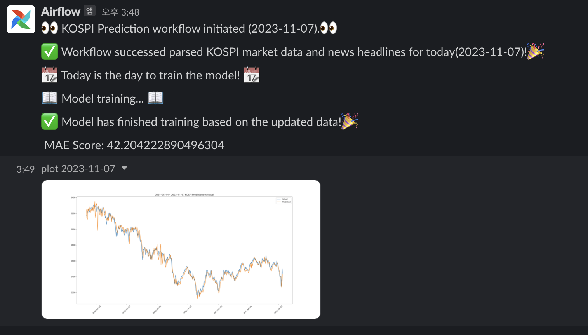
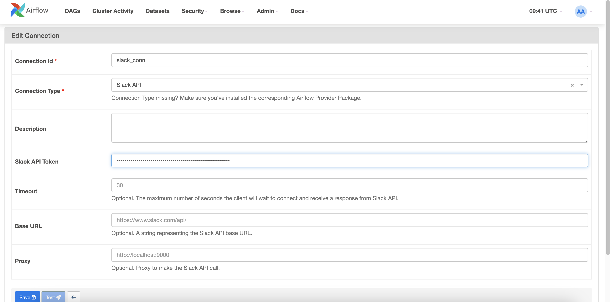
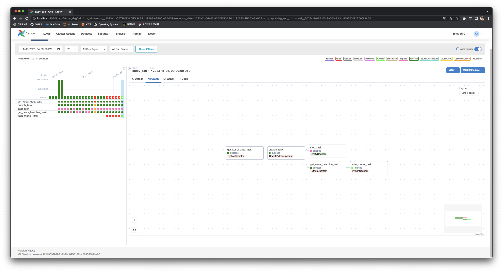
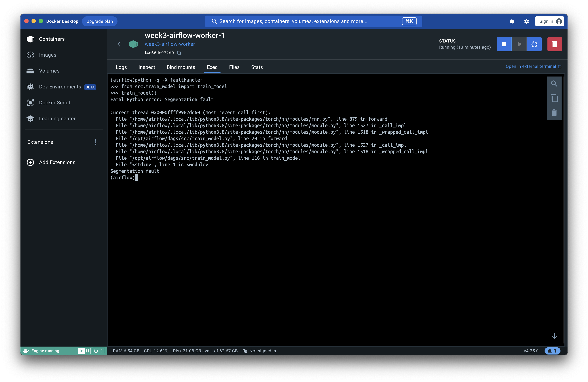
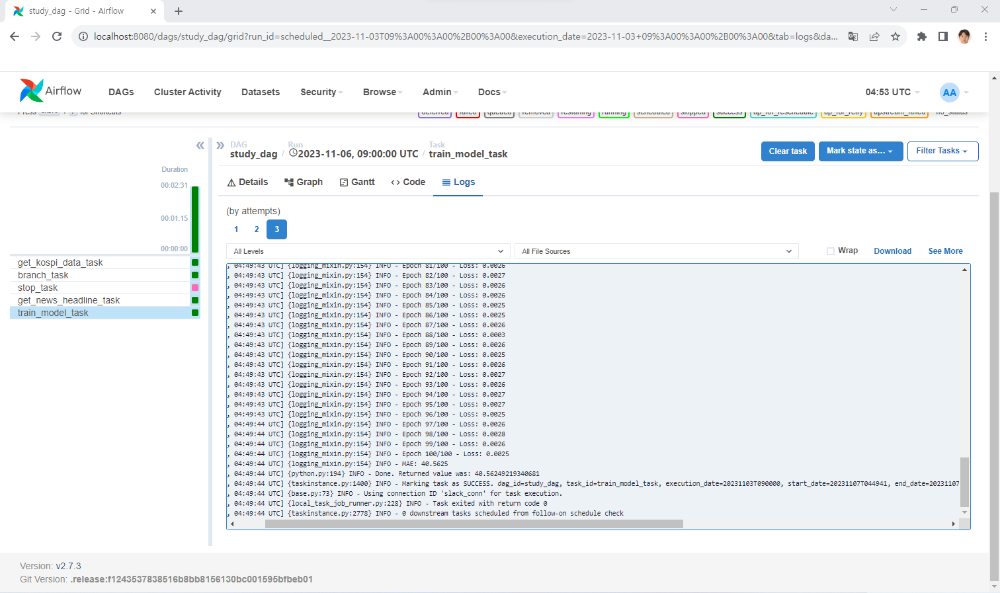
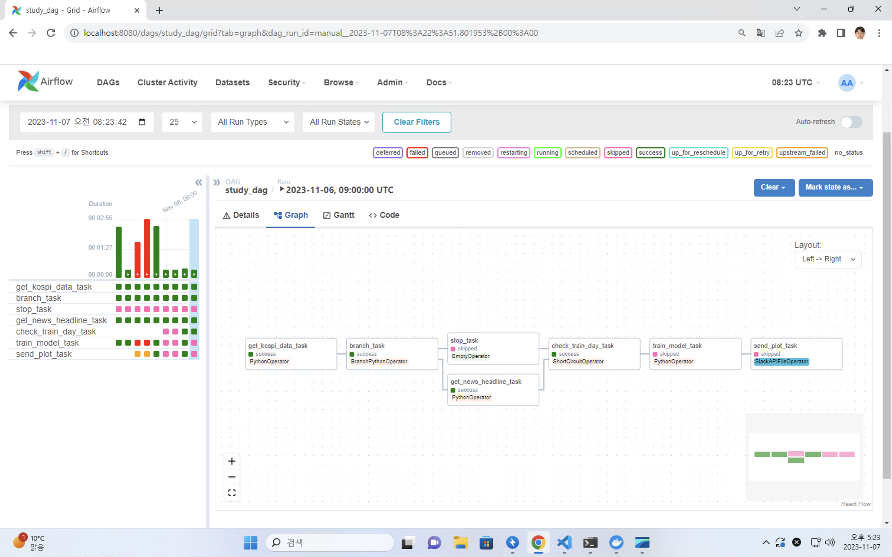

# Week3: Apache Airflow

## 1. Xcom 으로 값 전달 + Branching

주식 데이터를 불러오는 API에서 오늘이 시장 개장일인지 파악하여 개장일이 아닌 경우 이후 작업은 Pass하자.
단순 return으로 편리하게 값을 넘겨줄 수 있으며, BranchPythonOperator에서 xcom으로 해당 값을 읽어 branching을 수행한다.

```python
def branch_func(ti):
	xcom_value = bool(ti.xcom_pull(task_ids="get_kospi_data_task"))
	if xcom_value == True:
		return "get_news_headline_task"
	elif xcom_value == False:
		return "stop_task"
	else:
		return None

## 중략

branch_op = BranchPythonOperator(
	task_id="branch_task",
	python_callable=branch_func,
)

get_kospi_data_task >> branch_op >> [get_news_headline_task, stop_op]
```


이 외에도, 아래 Callback Message에서 Task 실행 결과를 전송하는 부분 등에서도 필요에 따라 적절하게 XCOM을 사용해 주었다.

## 2. Slack 연동

UI를 통해 작업 진행을 체크하기는 불편하고, 특히 작업 시간이 길어질수록 놓칠 여지가 생긴다. 다음 상황에 대해 Slack 메시지를 전달해 오류 발생 또는 완료 파악이 가능하게 하자!

- Workflow 실행 시작
- 주식 미개장일로 Workflow 종료
- Workflow 완료



이 외에도 각 단계 넘어가는 부분이나, Worklflow 실패에 대해 메시지 발송이 가능하다.

우선 [slack](https://api.slack.com/)에서 새 app을 만들고, Workspace에 등록한다.
메시지 발송이 가능하도록 chat:write 와 chat:write.public permission scope를 추가한다.

Airflow Web UI에서 Admin > Connections 에서 Slack에 대한 Connection을 추가한다.


- Connection ID: 임의로 설정 (DAG 코드에서 사용한 이름)
- Connection Type: Slack API
- Slack API Token: Slack app 권한 부여 페이지에서 확인 가능한 Bot User OAuth Token

이후 Dag에서는 Task마다 Slack API를 전송할 부분에 SlackNotifier를 사용해 주면 된다!

```python
from airflow.providers.slack.notifications.slack_notifier import SlackNotifier
SLACK_CONNECTION_ID = "slack_conn" # Connection ID
SLACK_CHANNEL = "workflows" # Slack에서 메시지를 전송할 채널명

## 중략

    get_kospi_data_task = PythonOperator(
        task_id='get_kospi_data_task',
        python_callable=get_kospi_data,
		on_execute_callback=SlackNotifier(
        	slack_conn_id=SLACK_CONNECTION_ID,
            text="""
			:eyes: KOSPI Market data & News Headline parsing workflow initiated ({{ds}}).:eyes:
            """,
            channel=SLACK_CHANNEL,
        )
    )
```

Task에 대해 SlackNotifier는 다음과 같은 조건으로 트리거할 수 있다.

- on_execute_callback: Task가 실행되기 전
- on_failure_callback: Task가 실패했을 때
- on_success_callback: Task가 성공했을 때
- on_retry_callback: Task가 재시도 되었을 때
- sla_miss_callback: Task가 SLA(Service Level Agreement)를 놓쳤을 때 (설정한 시간 내에 Task가 완료되지 않았을 때)

File 전송이나, 더 복잡한 조건의 수행을 위해, Callback이 아니라 Slack 전송을 operator를 이용해 하나의 Task로 구성하는것도 가능하다. [src](https://airflow.apache.org/docs/apache-airflow-providers-slack/stable/operators/slack_operator_howto_guide.html)

다음과 같이 모델 훈련 완료 후 결과 그래프를 전송하도록 구성하였다.

```python
from airflow.providers.slack.operators.slack import SlackAPIFileOperator

send_plot_task = SlackAPIFileOperator(
        task_id='send_plot_task',
        slack_conn_id=SLACK_CONNECTION_ID,
        filename="""/opt/airflow/data/plot/plot_{{ds}}.png""",
        filetype='png',
        channels=SLACK_CHANNEL,
)
```

**예시와 같이 (이미지) 파일 전송을 위해서는 Slack app에 files:write 권한을 추가로 부여해야 한다!**

## 3. 훈련 Task 추가

훈련 코드를 모듈화하여 DAG에 TASK로 추가하였다. 데이터 수집 이후에 실행이되도록 설정해 주었고 훈련 시작과 결과를 Check하기 위해 Slack Operator도 추가하여 주었다.



하지만 오랜 시간 고민하여 보았지만 모델 학습을 제대로 완료시키지 못했다. Airflow Web UI에서 훈련 Task가 시작되었음을 확인할 수 있었지만, 훈련이 완료되지 않고 Task는 종료되지 않고 계속 실행중인 상태에 머물러 있었다. Log를 확인해 보아도 별다른 에러 메시지를 확인할 수 없었다.

따라서 Worker Container에 terminal 명령어를 통해 해당 코드를 실행해 보아 Segmentation Fault가 발생한다는 사실을 알 수 있었다.
**Error 가 아니라 segfault와 같이 비정상적으로 workflow가 종료되면 Airflow에서 인식하지 못하고 실행중 상태로 표시된다.**

로컬 환경에서 잘 동작하는 훈련 코드가 왜 컨테이너에서는 Segmentation Fault가 발생하는지 잘 모르겠다...

열심히 찾아본 결과 Apple Silicon기기에서 PyTorch를 가상화 환경에서 실행할 때 아직 불안정해 오류가 종종 발생하는 것 같다.[유사사례](https://stackoverflow.com/questions/77290003/segmentation-fault-when-using-sentencetransformer-inside-docker-container)

Windows 환경에서 다시 Docker를 활용해 Airflow를 구성하고 Workflow를 실행한 결과 제대로 동작하였다.


데이터가 매일 축적될 때마다 훈련을 하는 것은 비효율적이라 생각하였다. 이를 위해 매일 데이터 수집 workflow는 진행되고, 매달 1일과 15일에만 훈련 Task가 진행되도록 구성하기로 하였다. 이를 위해서 `ShortCircuitOperator`를 사용해 준다.

`ShortCirucitOperator`는 `python_callable`의 실행 결과를 토대로 True일 경우에만 이후 Task가 실행된다.

```python
from airflow.operators.python import PythonOperator, BranchPythonOperator, ShortCircuitOperator

check_train_day_task = ShortCircuitOperator(
        task_id='check_train_day_task',
        trigger_rule='one_success',
        python_callable=lambda: True if pendulum.now('Asia/Seoul').day in [7, 15] else False,
        on_success_callback=SlackNotifier(
            slack_conn_id=SLACK_CONNECTION_ID,
            text= """
            :calendar: Today is the day to train the model! :calendar:
            """ if pendulum.now('Asia/Seoul').day in [7, 15] else """
            :calendar: Today is not the day to train the model! :calendar:
            Workflow will be terminated.
            """,
            channel=SLACK_CHANNEL,
        ),
    )
```

이를 활용해, 데이터 수집 (또는 장휴일로 인한 수집 생략!) 이후, 1일 또는 15일인지를 `ShortCircuitOperator`로 검사해 훈련 Task를 실행하도록 구성하였다. 이때 중요한 점은, 데이터 수집, 또는 장휴일로 인한 수집 생략 중 한 가지 Case만 완료되어도 훈련 Task가 실행되어야 하므로 `trigger_rule`을 `one_success`로 설정해 준다!

모델 학습이 진행되지 않는 날에는 이후 과정이 생략되는 것을 볼 수 있다.

```python

## TODO

- [ ] Kubernetes Executor 환경 구성
```
