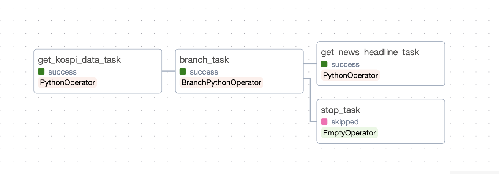

# Week2: Apache Airflow

## 1. Xcom 으로 값 전달 + Branching

주식 데이터를 불러오는 API에서 오늘이 시장 개장일인지 파악하여 개장일이 아닌 경우 이후 작업은 Pass하자.
단순 return으로 편리하게 값을 넘겨줄 수 있으며, BranchPythonOperator에서 xcom으로 해당 값을 읽어 branching을 수행한다.

```python
def branch_func(ti):
	xcom_value = bool(ti.xcom_pull(task_ids="get_kospi_data_task"))
	if xcom_value == True:
		return "get_news_headline_task"
	elif xcom_value == False:
		return "stop_task"
	else:
		return None

## 중략

branch_op = BranchPythonOperator(
	task_id="branch_task",
	python_callable=branch_func,
)

get_kospi_data_task >> branch_op >> [get_news_headline_task, stop_op]
```



## 2. Slack 연동

UI를 통해 작업 진행을 체크하기는 불편하고, 특히 작업 시간이 길어질수록 놓칠 여지가 생긴다. 다음 상황에 대해 Slack 메시지를 전달해 오류 발생 또는 완료 파악이 가능하게 하자!

- 주식 미개장일로 작업 종료
- 데이터 저장 완료
- 데이터 저장 실패
- 모델 학습 완료
- 모델 학습 실패
