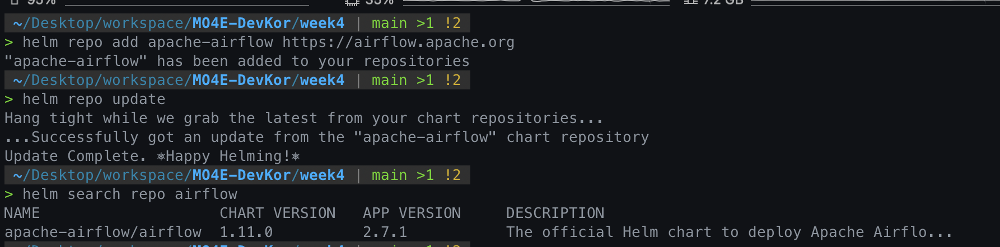
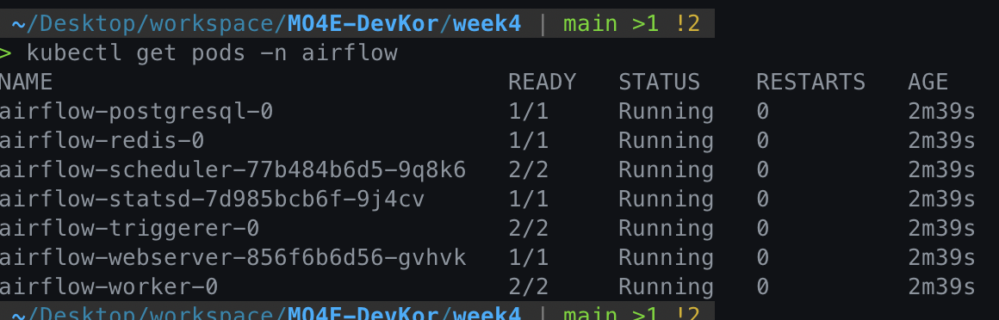
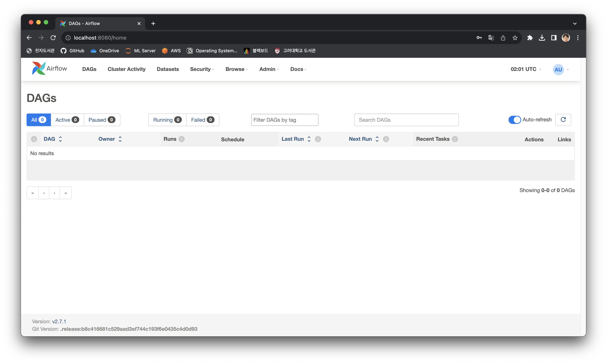
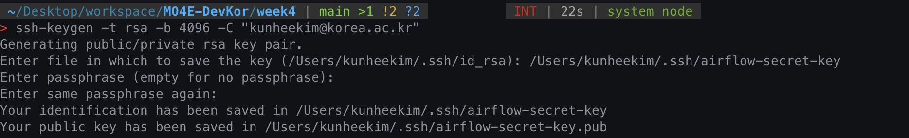
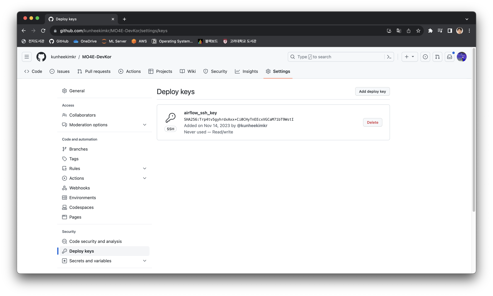
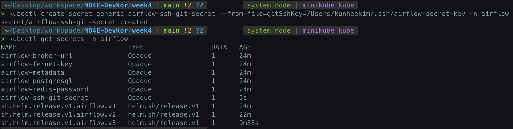
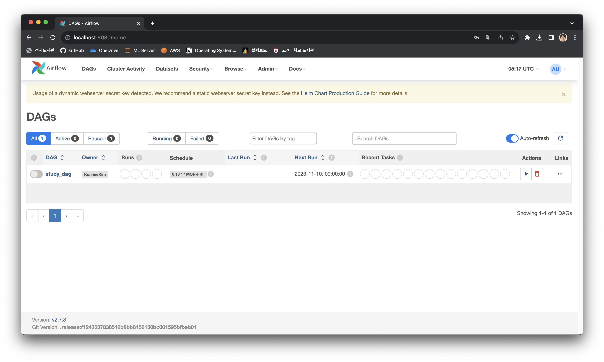
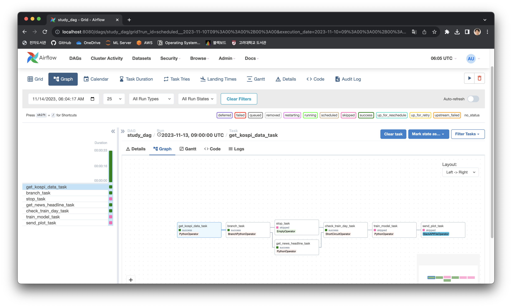

# Week4: Kubernetes에 Airflow 구성하기

최근 Kubernetes를 공부하고 있었기에, Airflow를 Kubernetes에 구성해보고 싶었다.
Minikube를 활용해 로컬 환경에서 구성을 해보았다.

## 1. Helm Chart를 활용해 Kubernetes에 Airflow 구성하기

Airflow는 크게 두 종류로 공식문서에서 제공하는 것과, User-community에서 제공하는 Helm Chart가 있다. 이중 [공식 문서](https://airflow.apache.org/docs/helm-chart/stable/index.html)에서 제공하는 것을 사용하였다.

```bash
helm repo add apache-airflow https://airflow.apache.org
helm repo update
helm search repo airflow
```



`airflow` namespace를 만들고, 해당 namespace에 helm chart를 이용해 airflow를 구성한다.

```bash
kubectl create namespace airflow
helm install airflow apache-airflow/airflow --namespace airflow --debug
```

완료되면, 다음과 같이 pod가 생성된 것을 확인할 수 있다.

```bash
kubectl get pods -n airflow
```



Web UI에 접근하기 위해서는 host와 webserver의 port를 포워딩해야한다.
기본 계정 ID/PW: admin/admin

```bash
kubectl port-forward svc/airflow-webserver 8080:8080 -n airflow
```



## 2. Dependency 설치하기

Week 2 에서 Dependency를 설치하기 위해, Dockerfile을 작성해 Custom Docker Image를 만들어 해당 이미지로 Airflow를 Build하였다.

Kubernetes에서 Airflow를 구성할 때도 같은 방법으로 다음 절차를 통해 진행하였다.

1. **Docker Image를 Minikube Cluster에 Load하기**
2. 해당 Image를 이용하도록 Helm Chart 설정을 수정하기

1번 과정에서, 로컬 Docker Daemon과 Minikube 가상환경의 Docker Daemon은 서로 다르기 때문에, Image를 Minikube Cluster로 Load 해야 해당 Image를 사용해 Pod를 구성할 수 있다.

```bash
eval $(minikube docker-env)
docker build . -t airflow-custom:1.0.0
```

배포된 Airflow Application의 기본 설정을 변경하기 위해서는 정의를 내려받은 뒤 변경하여 재배포를 수행한다.

```bash
helm show values apache-airflow/airflow > values.yaml
```

`values.yaml`파일에서 다음 부분을 수정하여 Custom Docker Image를 사용하도록 한다.

```yaml
# values.yaml
# Default airflow repository -- overridden by all the specific images below
defaultAirflowRepository: airflow-custom

# Default airflow tag to deploy
defaultAirflowTag: "1.0.0"
```

다음 명령을 통해 새로운 설정을 적용해 Update를 수행한다.

```bash
helm upgrade --install airflow apache-airflow/airflow --namespace airflow --values values.yaml --debug
```

## 3. DAG를 Git Sync를 통해 불러오기

Git Sync를 사용하면, 별도의 DAG 디렉토리를 관리할 필요 없이 Git Repository에서 DAG를 불러올 수 있으며, 형상 관리 및 협업 등에서 이점이 있다.
다음 절차를 통해 설정 가능하다.

1. ssh key pair 생성
2. Github Repository에 ssh public key를 Deploy key로 등록
3. SSH private key를 Kubernetes Secret으로 등록
4. Airflow 설정 파일에 SSH private key와 Repo를 등록하고 Git Sync 활성화

```bash
# ssh key pair 생성
ssh-keygen -t rsa -b 4096 -C "your_email@example.com"

# clipboard에 public key 복사
pbcopy < ~/.ssh/airflow-secret-key.pub
```



Github Repository의 Settings > Deploy keys > Add deploy key 에서 public key를 등록한다.



이제 Kubernetes Secret을 생성한다.

```bash
kubectl create secret generic airflow-ssh-git-secret --from-file=gitSshKey=/Users/{유저명}/.ssh/airflow-secret-key -n airflow
```



마지막으로, `values.yaml`파일에서 다음 부분을 수정한 후 helm upgrade를 수행한다.

```yaml
gitSync:
  enabled: true

  # git repo clone url
  # ssh example: git@github.com:apache/airflow.git
  # https example: https://github.com/apache/airflow.git
  repo: git@github.com:kunheekimkr/MO4E-DevKor.git # Repo 주소!
  branch: main
  rev: HEAD
  depth: 1
  # the number of consecutive failures allowed before aborting
  maxFailures: 0
  # subpath within the repo where dags are located
  # should be "" if dags are at repo root
  subPath: "week4/dags" # 알아서 수정!
  sshKeySecret: airflow-ssh-git-secret
```

Dag가 문제 없이 불러와진 것을 확인할 수 있다.


## 4. Volume Mount로 데이터 접근 및 저장하기

로컬 데이터에 Worker가 작업 수행을 위해 Read/Write 하기 위해, 해당 데이터가 Worker Pod에 Mount 되어야 한다. 이떄 2. 에서와 마찬가지로, container들은 Minikube 가상환경에서 파일 Mount를 수행하기 때문에, 우선 로컬 디렉토리를 Minikube 가상환경에 Mount 한 후, 해당 디렉토리를 airflow container에 Mount 해야한다.

1. 로컬 디렉토리를 Minikube 가상환경에 Mount
2. 해당 디렉토리를 Container에 Volume Mount하도록 values.yaml 수정

```bash
minikube mount "./data:/data" # data 폴더를 Minikube 가상환경에 /data 디렉토리로 마운트
```

다음과 같이 Volume Mount를 설정한다. Values.yaml 파일에 Volume Mount가 Container마다 가능한데, Worker에서만 파일 접근이 필요하므로 Worker에 대해 Mount를 설정해 준다.

```yaml
# Mount additional volumes into worker. It can be templated like in the following example:
#   extraVolumes:
#     - name: my-templated-extra-volume
#       secret:
#          secretName: '{{ include "my_secret_template" . }}'
#          defaultMode: 0640
#          optional: true
#
#   extraVolumeMounts:
#     - name: my-templated-extra-volume
#       mountPath: "{{ .Values.my_custom_path }}"
#       readOnly: true
extraVolumes:
  - name: data
    hostPath:
      path: /data
extraVolumeMounts:
  - name: data
    mountPath: /opt/airflow/data
    readOnly: false
```

Upgrade를 수행해 주면 모든 설정이 완료된다. 다음과 같이 Workflow가 문제 없이 수행된다!


