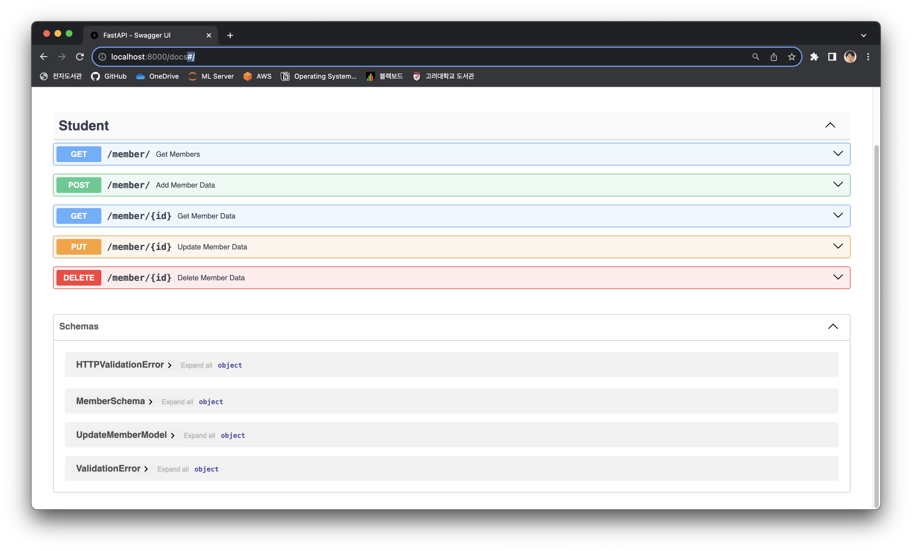

# Week 5: FastAPI

## Task

회원 관리 시스템을 만들려고 합니다.
회원은 id(int), name(string), age(int), role(string)이라는 property를 가지고 있습니다.
role은 admin과 student 두가지로 구분됩니다.
다음의 기능이 구현되어야 합니다.

1. 전체 사용자 조회
2. 사용자의 id를 이용해서 특정 사용자 조회
3. 특정 id를 가진 사용자 정보를 업데이트
4. 특정 id를 가진 사용자의 회원 탈퇴

(+ 추가) 사용자 추가

## API 명세

1. 사용자 추가

   - Endpoint: /users
   - Method: POST
   - Request Body:

   ```json
   {
     "name": "New User",
     "age": 20,
     "role": "student"
   }
   ```

   - Description: 새로운 사용자를 추가합니다.
   - Response:

   ```json
   {
     "id": 1,
     "name": "New User",
     "age": 20,
     "role": "student"
   }
   ```

2. 전체 사용자 조회

   - Endpoint: /users
   - Method: GET
   - Description: 전체 사용자 목록을 조회합니다.
   - Response:

   ```json
   [
     {
       "id": 1,
       "name": "New User",
       "age": 20,
       "role": "student"
     },
     {
       "id": 2,
       "name": "New User2",
       "age": 25,
       "role": "admin"
     }
   ]
   ```

3. 특정 사용자 조회

   - Endpoint: /users/{user_id}
   - Method: GET
   - Parameters:
     {user_id}: 조회하고자 하는 사용자의 고유한 ID
   - Description: 특정 ID를 가진 사용자의 정보를 조회합니다.
   - Response:

   ```json
   {
     "id": 1,
     "name": "New User",
     "age": 20,
     "role": "student"
   }
   ```

4. 사용자 정보 업데이트

   - Endpoint: /users/{user_id}
   - Method: PUT
   - Parameters:
     {user_id}: 업데이트하고자 하는 사용자의 고유한 ID
   - Request Body:

   ```json
   {
     "name": "Updated Name",
     "age": 25,
     "role": "admin"
   }
   ```

   - Description: 특정 ID를 가진 사용자의 정보를 업데이트합니다.
   - Response:

   ```json
   {
     "id": 1,
     "name": "Updated Name",
     "age": 25,
     "role": "admin"
   }
   ```

5. 사용자 회원 탈퇴
   - Endpoint: /users/{user_id}
   - Method: DELETE
   - Parameters:
     {user_id}: 삭제하고자 하는 사용자의 고유한 ID
   - Description: 특정 ID를 가진 사용자를 회원 탈퇴 처리합니다.
   - Response:
   ```json
   {
     "message": "User with id 1 has been deleted"
   }
   ```

## Lvl0. DB 대신 단순히 Dict만 사용해 구현

FastAPI를 통해 빠르게 API 구현이 가능하다.

```python
from enum import Enum

from fastapi import FastAPI
from pydantic import BaseModel

app = FastAPI()

class UserRole(Enum):
    ADMIN = "admin"
    STUDENT = "student"

class User(BaseModel):
    id: int
    name: str
    age: int
    role: UserRole

class UserCreate(BaseModel):
    name: str
    age: int
    role: UserRole

Users = [
    User(id=1, name="Alice", age=20, role=UserRole.ADMIN),
    User(id=2, name="Bob", age=21, role=UserRole.STUDENT),
    User(id=3, name="Charlie", age=22, role=UserRole.STUDENT),
]

@app.post("/users")
def create_user(body: UserCreate):
    new_user = User(id=len(Users)+1, name=body.name, age=body.age, role=body.role)
    Users.append(new_user)
    return new_user


@app.get("/users")
def read_users():
    return Users

@app.get("/users/{user_id}")
def read_item(user_id: int):
    return Users[user_id-1]

@app.put("/users/{user_id}")
def update_item(body: UserCreate, user_id: int):
    Users[user_id-1].name = body.name
    Users[user_id-1].age = body.age
    Users[user_id-1].role = body.role
    return Users[user_id-1]

@app.delete("/users/{user_id}")
def delete_item(user_id: int):
    Users.pop(user_id-1)
    return {
        "message": "User with id {} has been deleted".format(user_id)
    }
```


